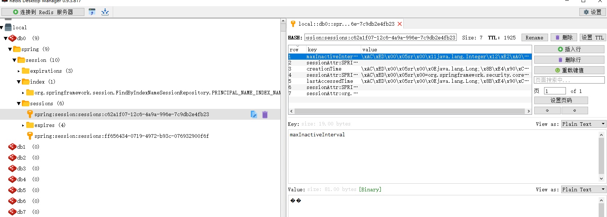

##HttpSession


> [官方文档](#official_docs)
>
> [注意问题](#notes_faq)
>

### 官方文档<a name="official_docs"></a>
https://docs.spring.io/spring-session/docs/current/reference/html5/guides/java-redis.html  


第一步，升级依赖
```
<dependency>
		<groupId>org.springframework.session</groupId>
		<artifactId>spring-session-data-redis</artifactId>
		<version>2.0.5.RELEASE</version>
		<type>pom</type>
	</dependency>
	<dependency>
		<groupId>io.lettuce</groupId>
		<artifactId>lettuce-core</artifactId>
		<version>5.0.4.RELEASE</version>
	</dependency>
	<dependency>
		<groupId>org.springframework</groupId>
		<artifactId>spring-web</artifactId>
		<version>5.0.8.RELEASE</version>
	</dependency>
```

第二步
The Spring configuration is responsible for creating a Servlet Filter that replaces the HttpSession implementation with an implementation backed by Spring Session. Add the following Spring Configuration:

The @EnableRedisHttpSession annotation creates a Spring Bean with the name of springSessionRepositoryFilter that implements Filter. The filter is what is in charge of replacing the HttpSession implementation to be backed by Spring Session. In this instance Spring Session is backed by Redis.
	We create a RedisConnectionFactory that connects Spring Session to the Redis Server. We configure the connection to connect to localhost on the default port (6379) For more information on configuring Spring Data Redis, refer to the 
 
### 注意问题<a name="notes_faq"></a>
@EnableRedisHttpSession 位于org.springframework.session.data.redis.config.annotation.web.http.EnableRedisHttpSession; 
需要引入  
```
        <!--  @EnableRedisHttpSession  -->
        <dependency>
            <groupId>org.springframework.session</groupId>
            <artifactId>spring-session-data-redis</artifactId>
            <version>2.0.2.RELEASE</version>
        </dependency> 

```

程序运行后可以在redis中看到如图的效果  



要确保你的redis设置密码， 如果没有设置密码，不要在配置文件中使用spring.redis.password=redis123


 

 
