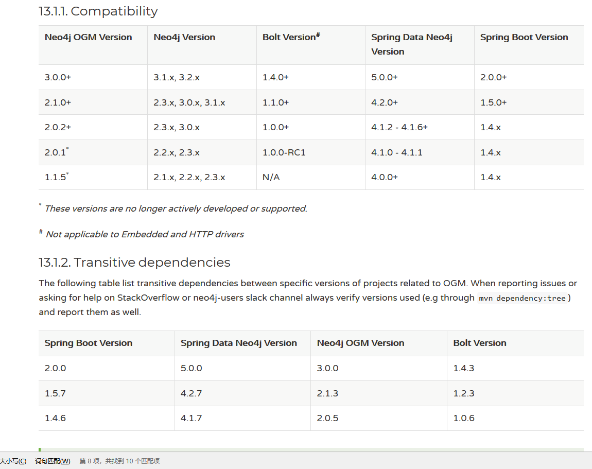

##spring-data-neo4j 升级到springboot2


> [官方文档](#official_docs)
>
> [注意问题](#notes_faq)
>

### 官方文档<a name="official_docs"></a>
Spring Boot 2的release notes  
https://github.com/spring-projects/spring-boot/wiki/Spring-Boot-2.0-Release-Notes  


Spring Boot 2迁移指南  
https://github.com/spring-projects/spring-boot/wiki/Spring-Boot-2.0-Migration-Guide

Spring 5迁移指南  
https://github.com/spring-projects/spring-framework/wiki/Upgrading-to-Spring-Framework-5.x#upgrading-to-version-50


https://projects.spring.io/spring-data-neo4j/  
https://neo4j.com/blog/spring-data-neo4j-5-0-release/  

Spring boot 1.5.x中使用的是spring-data-neo4j 4.2.11（主版本是4.x.x）

而Spring Boot 2.0.0中使用的是spring-data-neo4j 5.0.5

因此需要
https://neo4j.com/docs/ogm-manual/3.0/migration/?ref=blog  
https://docs.spring.io/spring-data/neo4j/docs/5.0.0.RELEASE/reference/html/#migration.5-0  


版本依赖关系表 



第一步，升级依赖
Spring Boot 2升级了spring-data-neo4j, 因此对应的ogm也需要升级
```
        <dependency>
            <groupId>org.neo4j</groupId>
            <artifactId>neo4j-ogm-bolt-driver</artifactId>
            <version>3.1.0</version>
        </dependency>
```

官方文档虽然这些可以使用5.0.0.RELEASE， 但是maven实际上无法解析，最后还是使用3.1.0
```
<!-- Only add if you're using the Bolt driver -->
<dependency>
    <groupId>org.neo4j</groupId>
    <artifactId>neo4j-ogm-bolt-driver</artifactId>
    <version>5.0.0.RELEASE</version>
    <scope>runtime</scope>
</dependency>
```


最主要的是升级neo4j-ogm-bolt-driver依赖到>3.1.0
之前都是使用的2.x.x


 
### 注意问题<a name="notes_faq"></a>

```


```


 

 